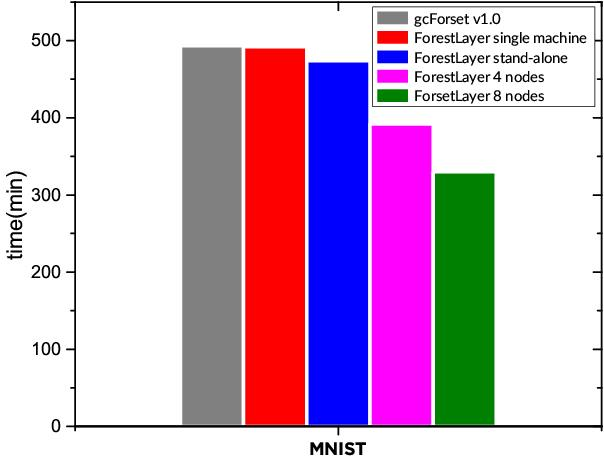

<a href="https://github.com/whatbeg/forestlayer">
<div align="center">
	
</div>
</a>

# ForestLayer

ForestLayer is a scalable, fast deep forest learning library based on Scikit-learn and Ray.
It provides rich data processing, model training, and serving modules to help researchers and engineers build practical deep forest learning workflows.
It internally embedded task parallelization mechanism using Ray, which is a popular flexible, high-performance distributed execution framework proposed by U.C.Berkeley.
<br>ForestLayer aims to enable faster experimentation as possible and reduce the delay from idea to result.</br>
<br>Hope is that ForestLayer can bring you good researches and good products.</br>

You can refer to [Deep Forest Paper](https://arxiv.org/abs/1702.08835), [Ray Project](https://github.com/ray-project/ray) to find more details.

## News

* [10 Jan] You can now use ForestLayer for classification and regression task. And you can use it in your data science algorithm competitions! We recommend using small layer of cascade in regression task since it's easy to overfit the data.
* [8 Jan] You can now use ForestLayer for classification task. See [examples](https://github.com/whatbeg/forestlayer/tree/master/examples)

## Installation

ForestLayer has install prerequisites including scikit-learn, keras, numpy, ray and joblib. For GPU support, CUDA and cuDNN are required, but now we have not support GPU yet. The simplest way to install ForestLayer in your python program is:
```
[for master version] pip install git+https://github.com/whatbeg/forestlayer.git
[for stable version] pip install forestlayer
```

Alternatively, you can install ForestLayer from the github source:
```
$ git clone https://github.com/whatbeg/forestlayer.git

$ cd forestlayer
$ python setup.py install
```

## What is deep forest?

## Getting Started: 30 seconds to ForestLayer

The core data structure of ForestLayer is layers and graph. Layers are basic modules to implement different data processing, and the graph is like a model that organize layers, the basic type of graph is a stacking of layers, and now we only support this type of graph.

Take MNIST classification task as an example.

First, we use the Keras API to load mnist data and do some pre-processing.
``` python
(x_train, y_train), (x_test, y_test) = mnist.load_data()
# TODO: preprocessing...
```

Next, we construct multi-grain scan windows and estimators every window and then initialize a `MultiGrainScanLayer`. The Window class is lies in `forestlayer.layers.window` package and the estimators are represented as `EstimatorArgument`s, which will be used later in layers to create actual estimator object.
``` python
rf1 = ExtraRandomForestConfig(min_samples_leaf=10, max_features='sqrt')
rf2 = RandomForestConfig(min_samples_leaf=10)

windows = [Window(win_x=7, win_y=7, stride_x=2, stride_y=2, pad_x=0, pad_y=0),
           Window(11, 11, 2, 2)]

est_for_windows = [[rf1, rf2], [rf1, rf2]]

mgs = MultiGrainScanLayer(windows=windows, est_for_windows=est_for_windows, n_class=10)
```

After multi-grain scan, we consider that building a pooling layer to reduce the dimension of generated feature vectors, so that reduce the computation and storage complexity and risk of overfiting.
``` python
pools = [[MaxPooling(2, 2), MaxPooling(2, 2)],
         [MaxPooling(2, 2), MaxPooling(2, 2)]]

pool = PoolingLayer(pools=pools)
```

And then we add a concat layer to concatenate the output of estimators of the same window.
``` python
concatlayer = ConcatLayer()
```

Then, we construct the cascade part of the model, we use an auto-growing cascade layer to build our deep forest model.
``` python
est_configs = [
    CompletelyRandomForest(),
    CompletelyRandomForest(),
    RandomForest(),
    RandomForest()
]

auto_cascade = AutoGrowingCascadeLayer(est_configs=est_configs, early_stopping_rounds=4,
                                       stop_by_test=True, n_classes=10)
```

Last, we construct a graph to stack these layers to make them as a complete model.
``` python
model = Graph()
model.add(mgs)
model.add(pool)
model.add(concatlayer)
model.add(auto_cascade)
```

You also can call `model.summary()` like Keras to see the appearance of the model. Summary info could be like follows table,
```
____________________________________________________________________________________________________
Layer                    Description                                                        Param #
====================================================================================================
MultiGrainScanLayer      [win/7x7, win/11x11]                                               params
                         [[FLCRF, FLRF][FLCRF, FLRF]]
____________________________________________________________________________________________________
PoolingLayer             [[maxpool/2x2, maxpool/2x2][maxpool/2x2, maxpool/2x2]]             params
____________________________________________________________________________________________________
ConcatLayer              ConcatLayer(axis=-1)                                               params
____________________________________________________________________________________________________
AutoGrowingCascadeLayer  maxlayer=0, esrounds=3                                             params
                         Each Level:
                         [FLCRF, FLCRF, FLRF, FLRF]
====================================================================================================
```

After building the model, you can `fit` the model, and then `evaluate` or `predict` using the fit model.
Note that we recommend to use `fit_transform` to train and test data, thus we can make `keep_in_mem=False` to avoid the cost of caching model in memory or disk.

``` python
# 1
model.fit(x_train, y_train)
model.evaluate(x_test, y_test)
result = model.predict(x_in)

# 2 (recommend)
model.fit_transform(x_train, y_train, x_test, y_test)
```

For more examples and tutorials, you can refer to [examples](https://github.com/whatbeg/forestlayer/tree/master/examples) to find more details.

## Benchmark

We tested some benchmarks on ForestLayer.
Below is the result of UCI Adult example, we ran the example using gcForest v1.0 (from FengJi, original paper), ForestLayer (single machine), ForestLayer standalone and ForestLayer cluster (2 nodes) respectively.

Our machine configuration mainly includes 64GB RAM, Intel Xeon CPU E5-2620 v2 @2.10GHz x86_64 which contains 24 CPU virtual cores, and 1Gbits network bandwidth.
Note that the models of all experiments contain the same structures, and have a single auto-growing cascade layer (in gcForest v1.0, it's called cascade_classifier), and every layer contains 8 random forests (4 completely random forests and 4 random forests with default configs of ForestLayer's `EstimatorArgument`).

*Table. 1: Performance on UCI Adult dataset.*

|  conf                   | test acc  | layer-best | avg time of 3 tries |
| :---:                   | :-----:   |  :----:    | :------:     |
| gcForest v1.0           | 86.143%    | 6-1        |  647s        |
| ForestLayer             | 86.143%    | 6-1        |  646s        |
| ForestLayer Standalone  | 86.143%    | 6-1        |  279s        |
| ForestLayer 2 nodes     | 86.143%    | 6-1        |  190s        |
| ForestLayer 4 nodes     | 86.143%    | 6-1        |  149s        |

<div align="center">
    
    <p><i>Figure 1. MNIST performance. (1.5x)</i></p>
	&nbsp;&nbsp;&nbsp;&nbsp;&nbsp;&nbsp;&nbsp;&nbsp;&nbsp;&nbsp;&nbsp;&nbsp;&nbsp;&nbsp;&nbsp;&nbsp;&nbsp;&nbsp;&nbsp;&nbsp;&nbsp;
	<p><i>Fig. 2 UCI Adult performance. (4.3x)&nbsp;&nbsp;&nbsp;&nbsp;&nbsp;&nbsp;&nbsp;&nbsp;&nbsp;&nbsp;&nbsp;&nbsp;&nbsp;&nbsp;&nbsp;&nbsp;&nbsp;&nbsp;&nbsp;&nbsp;&nbsp;&nbsp;&nbsp;&nbsp;&nbsp;&nbsp;&nbsp;&nbsp;&nbsp;&nbsp;&nbsp;&nbsp; Fig. 3 IMDB performance. (1.86x)</i></p>
</div>

From the first 2 lines of the table, we can conclude that ForestLayer has no loss of training speed of gcForest v1.0, but possess much simpler user-friendly API instead of configuring the model structure in the model json file.

And from all of the lines of the table, we can see, even in the Standalone mode, ForestLayer is **2.3x** faster than single machine implementation.
In cluster mode with 2 nodes, we obtain **3.4x** speedup. And with more nodes, the speedup will be so much better.

More benchmarks and performance evaluations will be given later.

## Examples

See [examples](https://github.com/whatbeg/forestlayer/tree/master/examples).

* [UCI Adult](https://github.com/whatbeg/forestlayer/blob/master/examples/uci_adult.py)
* [MNIST](https://github.com/whatbeg/forestlayer/blob/master/examples/mnist.py)
* [Distributed UCI Adult](https://github.com/whatbeg/forestlayer/blob/master/examples/dist_uci_adult.py)
* [Distributed MNIST](https://github.com/whatbeg/forestlayer/blob/master/examples/dist_mnist.py)
* [IMDB](https://github.com/whatbeg/forestlayer/blob/master/examples/imdb.py)
* [Regression - Boston Housing](https://github.com/whatbeg/forestlayer/blob/master/examples/bostonhousing.py)

etc.

## Design Principles

ForestLayer has some design principles to guide our design and implementation.
* **Easy Deployment.** ForestLayer is composed of layers and forest estimators. The layers include multi-grain scan layer, pooling layer and auto-growing cascade layer, etc. Forest estimators include random forest family, gradient-boosting tree family, we consider adding more estimators later. With these simple layer and estimators, you can feel free to build your model, then deploy it to the production environment, make it for data science competitions, or for other purposes rapidly.
* **High-speed.** ForestLayer has been endowed powerful model parallel capabilities by using Ray, an emerging flexible and high-performance distributed execution framework based on dynamic computation graph. Through the embedded ray, ForestLayer supports rapid scheduling and extremely high parallelism. So with the high degree of parallelism, practitioners can get the result several times faster than before.
* **Scalability.** ForestLayer achieves high scalability through effective task dispatching and relative balanced load, practitioners can add more machines(nodes) or use better equipment to gain higher efficiency, so that getting feedback of your idea more quickly.
* **Modularity.** In ForestLayer, a model, or a graph is composed of a sequence of standalone, fully-configurable modules, which is called layers, that can be combined together with as little restrictions as possible. Since we told above, multi-grain scan layers, pooling layers, concat layers and two kinds of cascade layers are all standalone modules that practitioners can plug together to build a custom-made model.
* **User Friendliness.** Last but not least, ForestLayer follows the Keras' interfaces, Keras is a high-level neural networks API that is very simple to use and user-friendly and has a large number of users all over the world. With the Keras-like API, practitioners can easily build the deep forest model according to your knowledge, with minimum learning cost.

## Contributions

## Citation

If you find it is useful, please cite our project in your project and paper.
```
@misc{qiuhu2018forestlayer,
  title={ForestLayer},
  author={Hu, Qiu and others},
  year={2018},
  publisher={GitHub},
  howpublished={\url{https://github.com/whatbeg/forestlayer}},
}
```


## License

ForestLayer is released under the Apache 2.0 license.

## TODO

* [ ] More layers, including lambda layer.
* [ ] Add model save and load mechanism
* [x] model.summary()
* [x] Distributed training
* [x] Add data save and load mechanism
* [x] Benchmarks (Part of it)
* [x] Documents
* [x] Different input data load and management
* [x] Regression task support
* [x] Add XGBoost classifier support
