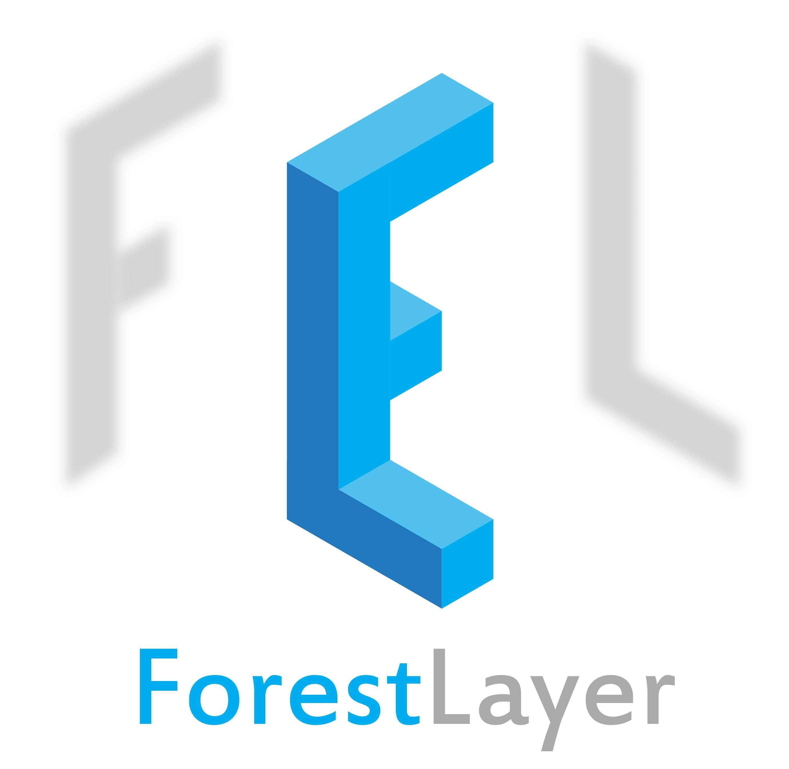

<a href="https://github.com/whatbeg/forestflow">
<div align="center">
	
</div>
</a>

# ForestLayer

ForestLayer is a scalable, fast deep forest learning library based on Scikit-learn and Ray.
It provides rich data processing, model training and serving modules to help researchers and engineers build practical deep forest learning workflows.
It internally embedded task parallelization mechanism using Ray, which is a popular flexible, high-performance distributed execution framework proposed by U.C.Berkeley.
ForestLayer aims to enable faster experimentation as possible, and reduce the delay from idea to result.
Hope is that ForestLayer can bring you good researches and good products.

You can refer to [Deep Forest Paper](https://arxiv.org/abs/1702.08835), [Ray Project](https://github.com/ray-project/ray) to find more details.

## News

* [8 Jan] You can now use ForestLayer for classification task. See [examples](https://github.com/whatbeg/forestlayer/tree/master/examples)

## Installation

ForestLayer has install prerequisites including scikit-learn, keras, numpy, ray and joblib. For GPU support, CUDA and cuDNN are required, but now we have not support GPU yet. The simplest way to install ForestLayer in your python program is:
```
[for master version] pip install git+https://github.com/whatbeg/forestlayer.git
[for stable version] pip install forestlayer
```

Alternatively, you can install ForestLayer from the github source:
```
$ git clone https://github.com/whatbeg/forestlayer.git

$ cd forestlayer
$ python setup.py install
```

## What is deep forest?

## Getting Started: 30 seconds to ForestLayer

## Examples

See [examples](https://github.com/whatbeg/forestlayer/tree/master/examples)

## Design Principles

ForestLayer has some design principles to guide our design and implementation.
* **Fast Deployment.** ForestLayer is composed of layers and forest estimators. The layers includes multi-grain scan layer, pooling layer, concat layer, cascade layer and auto-growing cascade layer. Forest estimators includes random forest, extremely(completely) random forest, gradient-boosting tree and xgboost, we consider to add LightGBM later. With these simple layer and estimators, you can feel free to building your model, then deploy it to production environment, make it for data science competitions, or for other purposes rapidly.
* **Fast Running.** ForestLayer uses Ray, an emerging flexible and high-performance distributed execution framework based on dynamic computation graph, which supports fast scheduling and simple task-level parallelism. So with the high degree of parallelism, you can get the result several times faster than before.
* **Scalability.** ForestLayer achieves high scalability with Ray, you can add more machines(nodes) or use better equipment to gain higher efficiency.
* **Modularity.** In ForestLayer, a model, or a graph is composed of a sequence of standalone, fully-configurable modules, which is called layers, that can be combined together with as little restrictions as possible. Since we told above, multi-grain scan layers, pooling layers, concat layers and two kind of cascade layers are all standalone modules that you can plugged together to build a custom-made model.
* **User Friendliness.** Last but not least, ForestLayer follows the Keras' interfaces, Keras is a high-level neural networks API that is very simple to use and user-friendly and has a large number of users all over the world. With the Keras-like API, you can easily build the deep forest model according to your knowledge, with minimum learning cost.

## Contributions

## Citation

If you find it is useful, please cite our project in your project and paper.
```
@misc{qiuhu2018forestlayer,
  title={ForestLayer},
  author={Hu, Qiu and others},
  year={2018},
  publisher={GitHub},
  howpublished={\url{https://github.com/whatbeg/forestlayer}},
}
```


## License

ForestLayer is released under the Apache 2.0 license.

## TODO

* Add model save and load mechanism
* [x] Different input data load and management
* [x] Regression task support
* [x] Add XGBoost classifier support
